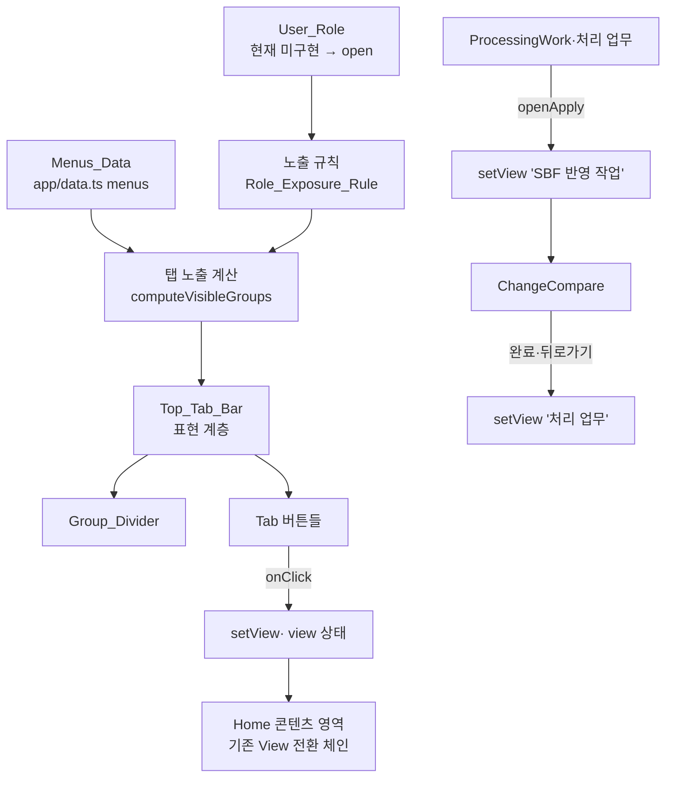

# 설계 문서 (Design)

## Overview

본 설계는 SBF-Manager의 좌측 세로 사이드바(`app/page.tsx`의 `<aside className="sidebar">`)를 화면 상단 가로 한 줄 탭 내비게이션(Top_Tab_Bar)으로 재구성하기 위한 설계를 정의한다. 원본 SBF 관리 화면과 동일하게 모든 탭을 상단 한 줄에 배치하고, 현재 사용자 역할에 허용된 Menu_Group의 Tab만 노출하는 방식(방식 1: 조건부 노출)을 채택한다.

다만 현재 시스템에는 사용자 권한 구분이 구현되어 있지 않아 모든 역할 권한이 개방(open) 상태이며, 그 결과 세 개 Menu_Group의 모든 Tab이 노출된다. 이때 서로 다른 역할의 탭이 뒤섞여 보이지 않도록 Menu_Group 사이에 Group_Divider(구분선/그룹 라벨/간격)를 두어 시각적으로 구분한다. 추후 권한 체계가 도입되면 그룹 단위 조건부 노출로 확장 가능하도록 노출 규칙을 데이터로 분리하여 설계한다.

본 문서는 설계만 정의하며 구현 코드는 포함하지 않는다.

### 설계 목표

- Top_Tab_Bar를 뷰포트 상단에 고정 배치하고, 노출 대상 Tab을 가로 한 줄(단일 행)로 표시한다. (Req 1)
- 기존 Menu_Group 구성(공통 / 변경요청자 / 검토자/관리자)과 각 그룹 내 Tab 순서를 유지한다. (Req 2)
- 역할 기반 조건부 노출 규칙을 데이터로 정의하되, 권한 미구현 동안에는 전체 개방으로 동작한다. (Req 3)
- 둘 이상의 Menu_Group이 동시 표시될 때 인접 그룹 사이에 Group_Divider를 하나씩 두어 시각적으로 구분한다. (Req 4)
- Tab 선택 시 재구성 이전과 동일한 View로 전환되도록 `view` 상태 문자열 비교 기반 판정을 유지한다. (Req 5)
- 'SBF 반영 작업'은 독립 Tab으로 노출하지 않으며, '처리 업무'를 통한 진입/복귀 동작을 유지한다. (Req 6)

### 현행 코드 기준 (재구성 대상)

- **메뉴 정의 원본(Menus_Data):** `app/data.ts`의 `menus` 배열.
  ```
  menus = [
    ['공통 메뉴',        ['대시보드', 'SBF 마스터']],
    ['변경요청자 메뉴',   ['변경요청', '내 요청']],
    ['검토자/관리자 메뉴', ['처리 업무', 'SBF 반영 작업', '변경이력', '데이터 가져오기', '배포관리']],
  ] as const
  ```
- **현행 렌더링 위치:** `app/page.tsx`의 `<aside className="sidebar">` 내부 `<nav aria-label="주 메뉴">`. 현재 `menus.map(g => <section>… g[1].filter(m => m !== 'SBF 반영 작업').map(m => <button onClick={() => setView(m)} …/>)</section>)` 형태로 세로 목록을 렌더링한다. 즉 'SBF 반영 작업'은 이미 목록에서 제외되어 있다.
- **View 전환 판정:** `const [view, setView] = useState('SBF 마스터')`. 콘텐츠 영역은 `view === '대시보드' ? … : view === 'SBF 반영 작업' ? … : …` 형태의 문자열 비교 체인으로 화면을 결정한다.
- **'SBF 반영 작업' 진입/복귀:** `ProcessingWork`(처리 업무)의 `openApply(id)`가 `setApplyRequestId(id); setView('SBF 반영 작업')`을 호출하여 진입한다. `ChangeCompare`의 완료/뒤로가기 콜백은 `setView('처리 업무')`로 복귀한다.

## Architecture

### 컴포넌트 구조

재구성은 기존 `<aside className="sidebar">`를 상단 가로 탭 컴포넌트(Top_Tab_Bar)로 치환한다. `Home` 컴포넌트의 상태(`view`, `setView` 등)와 콘텐츠 렌더링 로직(View 전환 체인)은 변경하지 않는다. Top_Tab_Bar는 "무엇을 보여줄지"를 결정하는 순수 계산 계층과, "어떻게 그릴지"를 담당하는 표현 계층으로 나눈다.



### 상태 흐름

1. **초기 렌더:** `Home`이 Menus_Data와 현재 User_Role을 기반으로 노출 대상 Menu_Group/Tab을 계산한다. 현재는 User_Role이 미구현이므로 전체 그룹이 노출된다.
2. **탭 선택:** 사용자가 Tab을 클릭하면 해당 Tab에 매핑된 View 식별자로 `setView`를 호출한다. 콘텐츠 영역은 기존과 동일한 문자열 비교 체인으로 화면을 전환한다.
3. **Active_Tab 표시:** Top_Tab_Bar는 `view` 상태와 각 Tab의 View 식별자를 비교하여 일치하는 하나의 Tab을 Active_Tab으로 표시한다.
4. **역할 변경(확장 지점):** User_Role이 변경되면 노출 규칙을 재평가하여 표시 Tab 집합을 갱신한다. 현재 Active_Tab이 비노출 그룹에 속하게 되면 표시 가능한 첫 Tab으로 재선택한다.
5. **'SBF 반영 작업' 흐름:** Top_Tab_Bar에는 노출되지 않는다. '처리 업무' View 내부 동작으로 진입하고, 완료/뒤로가기 시 '처리 업무' View로 복귀한다.

### 레이어 분리

| 레이어 | 책임 | 비고 |
| --- | --- | --- |
| 데이터 | Menus_Data(그룹/탭 정의), Role_Exposure_Rule(역할별 노출 그룹) | `app/data.ts` 기반, 규칙은 데이터로 분리 |
| 계산(순수 함수) | 현재 역할 → 노출 그룹 → 노출 탭 목록/순서 계산, Tab→View 매핑, Active_Tab 판정 | 부수효과 없음, 테스트 대상 |
| 표현 | Top_Tab_Bar 렌더링, Group_Divider 삽입, 가로 오버플로우 처리, Active_Tab 스타일 | 기존 CSS(`app/globals.css`)와 조화 |
| 상태/전환 | `view`/`setView` 및 기존 콘텐츠 View 전환 체인 | 변경 없음(Req 5.6 보장) |

## Components and Interfaces

### Top_Tab_Bar

- **역할:** 화면 최상단(뷰포트 상단 경계 고정)에 노출 대상 Tab을 가로 한 줄로 표시하는 내비게이션 영역. 기존 `<aside className="sidebar">`를 대체한다.
- **입력(props/파생값):**
  - `visibleGroups`: 노출 계산 결과. 각 원소는 `{ groupLabel, tabs: Tab[] }` 형태이며 Menus_Data 순서를 유지한다.
  - `activeView`: 현재 `view` 상태 문자열.
  - `onSelectTab(tab)`: Tab 선택 시 호출. 내부적으로 해당 Tab의 View 식별자로 `setView`를 호출한다.
- **렌더 규칙:**
  - 그룹 순서대로 각 그룹의 Tab을 왼쪽→오른쪽 순서로 연속 배치한다. (같은 그룹 Tab 사이에 다른 그룹 Tab이 끼지 않는다.)
  - 인접한 두 Menu_Group 사이마다 Group_Divider를 정확히 하나 배치한다. (표시 그룹이 하나뿐이면 Group_Divider를 표시하지 않는다.)
  - 각 Tab은 `activeView`와 자신의 View 식별자가 일치하면 Active_Tab 스타일을 적용한다.
  - 노출 대상 Tab이 0개면 Tab을 표시하지 않고 빈 Top_Tab_Bar 영역만 유지한다. (역할이 정의되지 않았거나 허용 그룹이 없는 경우에는 "사용 가능한 메뉴가 없음" 안내를 표시한다.)

### 탭 노출 계산 (computeVisibleGroups)

- **역할:** 현재 User_Role과 Menus_Data, Role_Exposure_Rule을 입력받아 노출 대상 Menu_Group과 각 그룹의 Tab 목록/순서를 계산하는 순수 함수.
- **규칙:**
  - Role_Exposure_Rule에서 현재 역할에 허용된 Menu_Group만 남긴다. 규칙에 명시되지 않은 그룹은 비노출로 처리한다.
  - 권한 미구현(open) 상태에서는 세 그룹 모두 허용으로 간주한다.
  - 노출 그룹의 순서는 항상 Menus_Data 정의 순서를 따른다.
  - 'SBF 반영 작업' 항목은 어떤 그룹에서도 Tab 목록에 포함하지 않는다.
  - 역할이 미정의/알 수 없음이거나 허용 그룹이 하나도 없으면 빈 목록을 반환한다.

### Tab → View 매핑 (resolveViewForTab)

- **역할:** Tab 라벨을 기존 `view` 상태 문자열(View 식별자)로 매핑하는 순수 함수. 재구성 이전과 동일한 View 전환 판정 결과를 보장한다. (Req 5.6)
- **규칙:**
  - 현재 시스템에서 Tab 라벨과 View 식별자는 동일 문자열이다(예: '대시보드' Tab → `view='대시보드'`). 따라서 기본 매핑은 항등(identity)이다.
  - 매핑된 View가 존재하지 않는 Tab을 선택하면 View 전환을 수행하지 않고 이전 View와 Active_Tab 상태를 유지하며 오류를 표시한다.

### Role_Exposure_Rule (역할 기반 노출 규칙)

- **역할:** Menu_Group 단위로 각 User_Role의 노출 허용 여부를 정의하는 데이터. 규칙에 명시되지 않은 Menu_Group은 비노출로 처리한다. (Req 3.3)
- **현재 상태:** 권한 미구현이므로 모든 역할에 세 그룹 전체를 허용하는 "open" 규칙으로 동작한다. 향후 역할이 추가되면 이 규칙 데이터만 수정하여 그룹 단위 조건부 노출로 확장한다. (확장 지점)

### 'SBF 반영 작업' 진입/복귀 인터페이스

- **역할:** 독립 Tab 없이 기존 진입 경로를 유지한다.
- **규칙:**
  - '처리 업무' View 내부 동작(`openApply`)으로 `view='SBF 반영 작업'`에 진입한다. 진입 후 화면은 독립 Tab 제거 이전과 동일한 항목/입력 필드/실행 가능한 동작을 제공한다.
  - 완료 또는 뒤로가기 시 `view='처리 업무'`로 복귀하고, Top_Tab_Bar에서는 '처리 업무' Tab이 Active_Tab으로 표시된다.
  - 진입이 실패하면 오류 메시지를 표시하고 '처리 업무' View에 머무르며 작업 데이터를 변경하지 않는다.

## Data Models

### Tab

| 필드 | 타입 | 설명 |
| --- | --- | --- |
| `label` | string | Top_Tab_Bar에 표시되는 Tab 이름. Menus_Data의 탭 라벨 값. |
| `viewId` | string | 선택 시 전환할 View 식별자(`view` 상태 값). 현재는 `label`과 동일. |
| `order` | number | 그룹 내 정렬 순서. Menus_Data 배열 순서에서 파생. |

### Menu_Group

| 필드 | 타입 | 설명 |
| --- | --- | --- |
| `groupLabel` | string | 그룹 라벨('공통 메뉴' / '변경요청자 메뉴' / '검토자/관리자 메뉴'). |
| `order` | number | 그룹 간 정렬 순서. Menus_Data 배열 순서에서 파생. |
| `tabs` | Tab[] | 그룹에 속한 Tab 목록('SBF 반영 작업' 제외). |

### Role_Exposure_Rule

| 필드 | 타입 | 설명 |
| --- | --- | --- |
| `role` | string | User_Role 식별자. 현재 미구현 상태에서는 open 단일 규칙. |
| `allowedGroups` | string[] | 해당 역할에 노출 허용되는 groupLabel 목록. 명시되지 않은 그룹은 비노출. |

### 노출 계산 결과 (VisibleGroup)

| 필드 | 타입 | 설명 |
| --- | --- | --- |
| `groupLabel` | string | 노출되는 그룹 라벨. |
| `tabs` | Tab[] | 노출되는 Tab 목록(그룹 내 순서 유지). |

Group_Divider는 별도 데이터가 아니라, 노출 그룹이 2개 이상일 때 인접 그룹 사이에 삽입되는 렌더 구성 요소다.

### Menu_Group ↔ Tab ↔ View 매핑표

| Menu_Group | Tab (label) | View 식별자 (viewId) | 비고 |
| --- | --- | --- | --- |
| 공통 메뉴 | 대시보드 | 대시보드 | |
| 공통 메뉴 | SBF 마스터 | SBF 마스터 | 기본 진입 View |
| 변경요청자 메뉴 | 변경요청 | 변경요청 | |
| 변경요청자 메뉴 | 내 요청 | 내 요청 | |
| 검토자/관리자 메뉴 | 처리 업무 | 처리 업무 | 'SBF 반영 작업' 진입점 |
| 검토자/관리자 메뉴 | 변경이력 | 변경이력 | |
| 검토자/관리자 메뉴 | 데이터 가져오기 | 데이터 가져오기 | |
| 검토자/관리자 메뉴 | 배포관리 | 배포관리 | |
| (Tab 아님) | SBF 반영 작업 | SBF 반영 작업 | Top_Tab_Bar 비노출, '처리 업무' 경유 진입 |

### 가로 오버플로우 처리

노출 대상 Tab의 총 너비가 Top_Tab_Bar 가용 너비를 초과하는 경우, 줄바꿈 없이 단일 행을 유지하고 가로 스크롤로 나머지 Tab에 접근한다. (Req 1.5) 표현 계층에서 `app/globals.css`와 조화되도록 단일 행 + 가로 스크롤 스타일을 적용한다(구현 세부는 태스크 단계에서 정의).

## Correctness Properties

*속성(property)은 시스템의 모든 유효한 실행에서 참이어야 하는 특성 또는 동작으로, 시스템이 무엇을 해야 하는지에 대한 형식적 진술이다. 속성은 사람이 읽는 명세와 기계로 검증 가능한 정확성 보장 사이의 다리 역할을 한다.*

본 기능에서 상단 탭 배치 계산 계층(노출 그룹/탭 계산, Group_Divider 삽입 규칙, Active_Tab 판정, Tab→View 매핑)은 입력에 따라 결과가 달라지는 순수 로직이므로 속성 기반 테스트 대상이다. 아래 속성은 요구사항의 수용 기준에서 도출하였다. 각 속성은 이 계산 계층의 순수 함수를 대상으로 하며, 렌더 배치(단일 행/고정 위치 등)와 외부 흐름 검증은 Testing Strategy의 단위/통합/예시 테스트로 다룬다.

### Property 1: Menus_Data 순서 보존

*임의의* Menus_Data와 임의의 User_Role에 대해, 노출 계산 결과의 Menu_Group 배치 순서와 각 그룹 내 Tab 배치 순서는 항상 Menus_Data 정의 순서의 부분수열이어야 한다.

**Validates: Requirements 1.4, 4.4**

### Property 2: 역할 기반 노출 정합성

*임의의* Menus_Data, Role_Exposure_Rule, 현재 User_Role에 대해, 노출 계산 결과에 포함된 모든 Tab은 현재 역할에 허용된 Menu_Group에 속해야 하며, 허용되지 않았거나 규칙에 명시되지 않은 Menu_Group의 Tab은 결과에 하나도 포함되지 않아야 한다. (역할 변경 후 재평가 결과도 새 역할 기준으로 동일 속성을 만족한다.)

**Validates: Requirements 3.1, 3.3, 3.4**

### Property 3: 그룹 인접 연속 배치

*임의의* 노출 계산 결과에 대해, 렌더 순서로 나열된 Tab 시퀀스를 각 Tab의 소속 Menu_Group으로 매핑하면 동일한 Menu_Group에 속한 Tab들은 항상 하나의 연속 구간을 이루어야 한다(같은 그룹 Tab 사이에 다른 그룹 Tab이 배치되지 않는다).

**Validates: Requirements 4.2**

### Property 4: Group_Divider 개수

*임의의* 노출 계산 결과에서 노출 Menu_Group 수가 N일 때, 인접 그룹 사이에 삽입되는 Group_Divider의 개수는 항상 정확히 max(0, N - 1)이어야 한다.

**Validates: Requirements 4.1, 4.3**

### Property 5: Active_Tab 유일성

*임의의* 노출 Tab 집합과 임의의 현재 View 식별자에 대해, Active_Tab으로 판정되는 노출 Tab의 개수는 해당 View에 매핑되는 노출 Tab이 존재하면 정확히 1개, 존재하지 않으면 0개여야 한다.

**Validates: Requirements 5.2, 5.3**

### Property 6: 재선택 후 Active_Tab 정합성

*임의의* 이전 Active_Tab과 임의의 User_Role 조합에 대해, 노출 규칙 재평가 후의 Active_Tab은 표시 가능한 Tab이 하나라도 있으면 반드시 표시 Tab 집합에 포함되어야 하고(이전 Active_Tab이 비노출이 되면 표시 Tab 중 첫 번째로 재선택), 표시 가능한 Tab이 없으면 Active_Tab이 선택되지 않아야 한다.

**Validates: Requirements 3.6**

### Property 7: 재선택 멱등성

*임의의* 상태와 임의의 Tab에 대해, 같은 Tab을 두 번 연속 선택한 결과의 View 식별자는 한 번 선택한 결과의 View 식별자와 동일해야 한다.

**Validates: Requirements 5.4**

### Property 8: Tab → View 매핑 등가성

*임의의* Tab에 대해, resolveViewForTab이 산출하는 View 식별자는 재구성 이전의 View 전환 판정과 동일한 View 식별자와 일치해야 한다(현재 매핑에서는 Tab 라벨과 View 식별자가 항등 관계이므로 항등 매핑이 성립한다).

**Validates: Requirements 5.6**

### Property 9: 'SBF 반영 작업' 상시 제외

*임의의* Menus_Data(open 규칙 포함)와 임의의 User_Role에 대해, 노출 계산 결과의 어떤 Tab 목록에도 'SBF 반영 작업' 라벨의 Tab이 포함되지 않아야 한다.

**Validates: Requirements 6.1**

## Error Handling

| 상황 | 처리 | 관련 요구사항 |
| --- | --- | --- |
| Menus_Data가 비었거나 노출 대상 Tab이 0개 | Tab을 표시하지 않고 빈 Top_Tab_Bar 영역만 유지 | 1.6 |
| User_Role이 미정의/알 수 없음 또는 허용 Menu_Group이 하나도 없음 | 어떤 Tab도 표시하지 않고 "사용 가능한 메뉴가 없음" 안내 표시 | 3.5 |
| 노출 규칙 적용 후 현재 Active_Tab이 비노출 그룹에 속함 | 표시 Tab 중 첫 번째를 Active_Tab으로 재선택. 표시 Tab이 없으면 Active_Tab 미선택 | 3.6 |
| 선택한 Tab에 매핑된 View가 존재하지 않음 | View 전환을 수행하지 않고 이전 View 및 Active_Tab 상태 유지, 매핑 없음 오류 표시 | 5.5 |
| '처리 업무'를 통한 'SBF 반영 작업' 진입 실패 | 진입 실패 오류 메시지 표시, '처리 업무' View 유지, 작업 데이터 불변 | 6.4 |

## Testing Strategy

### 접근 방식

- **속성 테스트(Property tests):** 위 Correctness Properties 9개는 배치 계산 계층의 순수 함수(computeVisibleGroups, Group_Divider 삽입 계산, Active_Tab 판정, resolveViewForTab, 재선택 함수)를 대상으로 속성 기반 테스트로 검증한다. Menus_Data, Role_Exposure_Rule, User_Role, 현재 View, 이전 Active_Tab을 무작위 생성한다.
- **단위/예시 테스트(Unit/Example tests):** 특정 그룹 구성(공통/변경요청자/검토자·관리자의 구체 탭 순서, Req 2.1~2.5), open 상태 전체 노출(Req 3.2), 대표 탭 선택 시 View 전환(Req 5.1), 제외 대상 이미지 전용 메뉴 부재(Req 2.4)를 예시 테스트로 검증한다.
- **엣지 케이스 테스트(Edge-case tests):** 빈 Menus_Data/0개 노출(1.6), 미정의·알 수 없음·빈 허용 역할(3.5), 매핑 없는 Tab 선택(5.5), 그룹 1개 시 Divider 0개(4.3), 진입 실패(6.4)를 속성 제너레이터 경계 및 예시로 포함한다.
- **통합/렌더 테스트(Integration/render tests):** Top_Tab_Bar의 상단 고정 위치(1.1), 세로 사이드바 부재 + 상단 탭만 존재(1.2), 단일 행 배치(1.3), 가로 오버플로우 시 단일 행 유지 + 가로 스크롤(1.5), '처리 업무' 경유 'SBF 반영 작업' 진입/복귀 흐름(6.2, 6.3)은 렌더링 테스트(React Testing Library 등)와 스냅샷/시각 확인으로 검증한다.

### 속성 기반 테스트 구성 규칙

- 대상 언어(TypeScript/React)에 맞는 속성 기반 테스트 라이브러리(예: fast-check)를 채택하고, 속성 검증 프레임워크를 직접 구현하지 않는다.
- 각 속성 테스트는 무작위성으로 인해 최소 100회 이상 반복 실행하도록 구성한다.
- 각 속성 테스트에는 설계 문서의 속성을 참조하는 주석 태그를 단다.
- 태그 형식: **Feature: horizontal-tab-navigation, Property {번호}: {속성 텍스트}**
- 각 Correctness Property는 하나의 속성 기반 테스트로 구현한다.

### 단위 테스트 균형

- 속성 테스트가 광범위한 입력 커버리지를 담당하므로 단위 테스트는 과도하게 작성하지 않는다.
- 단위/예시 테스트는 구체적인 그룹 구성 검증, 대표 View 전환, 컴포넌트 간 통합 지점('SBF 반영 작업' 진입/복귀), 오류/경계 조건에 집중한다.

### 회귀 보장 (Req 5.6)

재구성 전후의 View 전환 판정 동등성은 Property 8과 예시 테스트로 이중 검증한다. 매핑표(Menu_Group ↔ Tab ↔ View)의 각 항목이 기존 `view` 상태 문자열과 일치하는지 참조 매핑 기준으로 확인한다.
